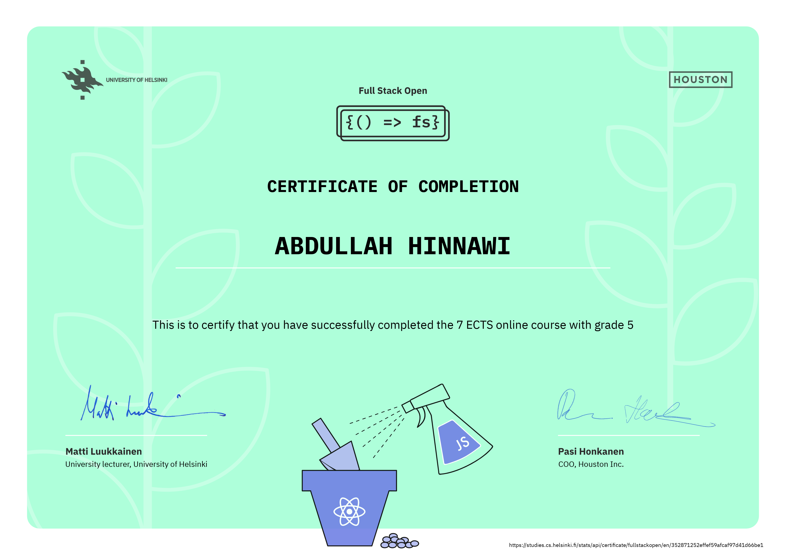
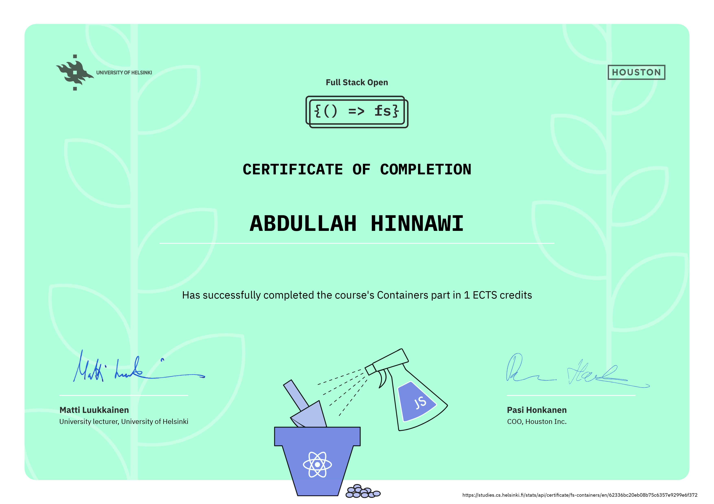

# Deep Dive Into Modern Web Development

## [Full Stack Open](https://fullstackopen.com/en/)

### ✨ [Course Certificate (parts 0 to 7)](https://studies.cs.helsinki.fi/stats/api/certificate/fullstackopen/en/352871252effef59afcaf97d41d66be1)

### ✨ [TypeScript (part 9) Certificate](https://studies.cs.helsinki.fi/stats/api/certificate/fs-typescript/en/90a7afd0a6b146da9a71bb4617ba8567)

### ✨ [Containers (part 12) Certificate](https://studies.cs.helsinki.fi/stats/api/certificate/fs-containers/en/62336bc20eb08b75c6357e9299e6f372)

