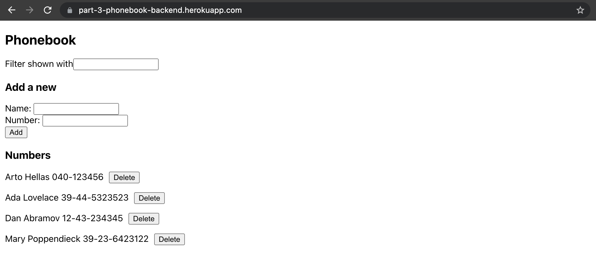
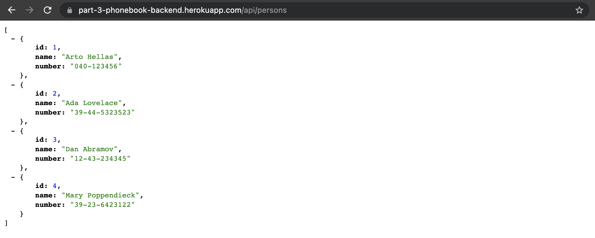
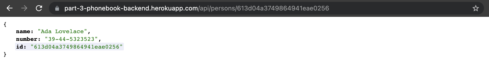
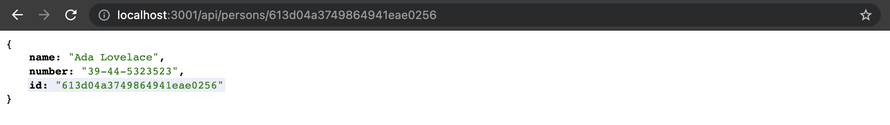
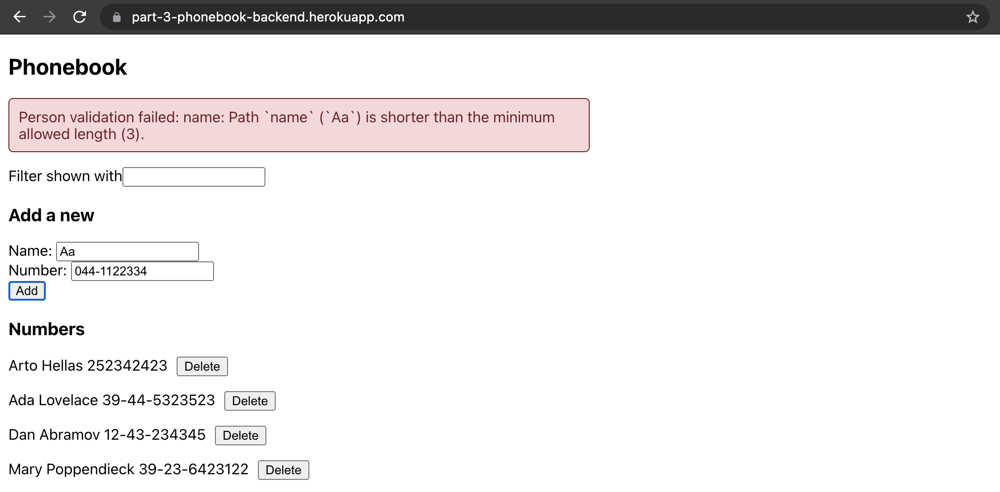
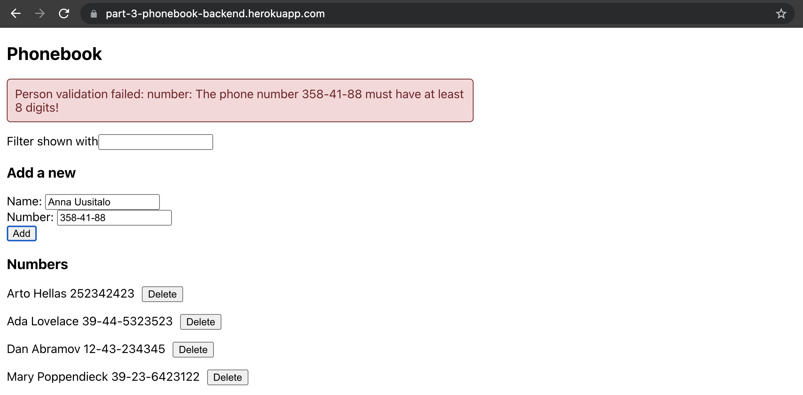
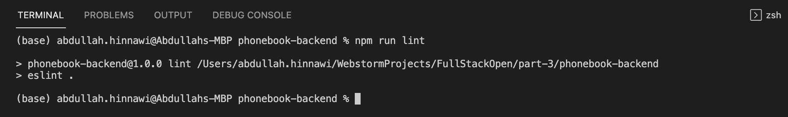

## Phonebook full stack

https://part-3-phonebook-backend.herokuapp.com/

#### Phonebook app

#### GET all persons

#### GET person by id

#### GET person by id locally

#### Name validation

#### Number validation

#### ESlint check

